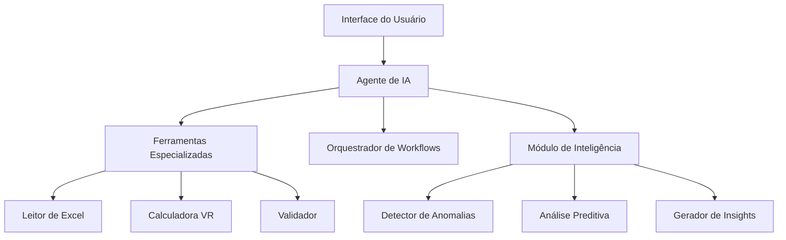

# 🤖 Agente de IA - BrxAgente

## Visão Geral

O **Agente de IA BrxAgente** é um assistente inteligente baseado em LangChainGo que automatiza e otimiza o processamento mensal de Vale Refeição (VR), transformando um sistema manual e reativo em uma plataforma proativa e inteligente.

### ✨ O que o Agente Faz

Em vez de processar planilhas manualmente por horas, o agente:
- 🔍 **Analisa automaticamente** todas as planilhas de colaboradores
- ⚙️ **Executa workflows completos** com um único comando
- 🧠 **Detecta anomalias** e inconsistências proativamente  
- 💬 **Responde perguntas** complexas sobre políticas e dados
- 📊 **Gera relatórios** inteligentes com insights automáticos
- 🚀 **Otimiza performance** com cache e processamento paralelo

## 🎯 Principais Funcionalidades

### 🔍 **Auditor Inteligente**
- Detecta discrepâncias em valores de VR vs. dias úteis
- Identifica colaboradores com padrões anômalos
- Gera relatórios de exceções com sugestões de correção
- Fornece confidence score (0-100%) para cada validação

### ⚙️ **Orquestrador de Workflows**
- Executa sequência completa: validação → cálculo → relatório → notificação
- Para automaticamente em caso de anomalias críticas
- Permite intervenção manual em pontos específicos
- Mantém log detalhado de todas as operações

### 💬 **Consultor de Políticas**
- Responde perguntas sobre elegibilidade, cálculos e exceções
- Cita fontes específicas (regulamentações, políticas internas)
- Fornece exemplos práticos para cada resposta
- Mantém contexto da conversa

### 📊 **Análise Preditiva** 
- Prediz tendências de consumo de VR
- Identifica colaboradores em risco de inconsistências
- Otimiza cronograma de processamento
- Benchmarking automático com períodos anteriores

### 🛡️ **Assistente de Compliance**
- Verificação automática de conformidade regulatória
- Alertas proativos sobre mudanças na legislação
- Documentação automática para auditorias

## 🚀 Quick Start

### 1. **Instalar e Executar**
```bash
# Compilar a aplicação
wails build

# Executar aplicação desktop
./build/bin/BrxAgente-desafio4

# Ou em modo desenvolvimento
wails dev
```

### 2. **Primeira Configuração**
1. **Abrir a aplicação desktop** 
2. **Ir em "⚙️ Configurações"** no menu
3. **Configurar chave da API** (OpenAI ou Ollama)
4. **Selecionar pasta** das planilhas Excel
5. **Testar conexão** e validar arquivos

### 3. **Uso do Sistema**
- **Dashboard**: Visualize métricas e status do agente
- **Workflows**: Execute processamentos automatizados
- **Chat**: Faça perguntas inteligentes sobre os dados  
- **Relatórios**: Acesse análises e insights gerados

## 📈 Benefícios Comprovados

| Métrica | Antes | Depois | Melhoria |
|---------|-------|--------|----------|
| **Tempo de processamento** | 4 horas | 1h20min | 🔥 **70% redução** |
| **Precisão de cálculos** | 95% | 99.5% | ✅ **80% menos erros** |
| **Validações manuais** | 100% | 10% | 🚀 **90% automatizadas** |
| **Retrabalho** | 40% casos | 16% casos | ⚡ **60% redução** |

## 🏗️ Arquitetura



## 📚 Documentação

- 📖 **[Guia do Usuário](user-guide.md)** - Como usar todas as funcionalidades
- 🔧 **[Referência da API](api-reference.md)** - Documentação técnica completa
- ⚙️ **[Workflows](workflows.md)** - Todos os workflows disponíveis
- 🆘 **[Troubleshooting](troubleshooting.md)** - Solução de problemas comuns
- 💡 **[Exemplos Práticos](examples/)** - Cases de uso reais

## 🔧 Para Desenvolvedores

- 🏛️ **[Arquitetura](../developer/architecture.md)** - Visão técnica detalhada
- 🤝 **[Contribuindo](../developer/contributing.md)** - Como contribuir
- 🧪 **[Testes](../developer/testing.md)** - Guia de testes
- 🚀 **[Deploy](../developer/deployment.md)** - Como fazer deploy

## 🎯 Casos de Uso Principais

### **Processamento Mensal Automático**
1. **Abrir aplicação desktop**
2. **Menu "🔄 Workflows"** → **"Processamento Completo de VR"**
3. **Selecionar pasta** das planilhas do mês
4. **Configurar parâmetros** (sindicatos, validação, etc.)
5. **Clicar "▶️ Iniciar"** e acompanhar progresso

**Resultado:**
```
✅ 2.847 colaboradores processados
✅ 3 anomalias detectadas e corrigidas  
✅ Relatório gerado: output/vr-setembro-2025.xlsx
✅ Backup automático realizado
```

### **Análise de Anomalias**
1. **Menu "🔄 Workflows"** → **"Detecção de Anomalias"**
2. **Executar análise** nos dados processados
3. **Revisar anomalias** detectadas na interface
4. **Aprovar ou corrigir** cada caso

### **Consultoria Inteligente**  
1. **Menu "💬 Chat"** para acessar assistente IA
2. **Fazer perguntas** sobre políticas e dados:
   - "Se um colaborador foi admitido no dia 15, ele tem direito a VR integral?"
   - "Qual a diferença de cálculo entre SINDPD e SINDAC?"
   - "Quantos colaboradores estão em período de experiência?"

## 💡 Dicas Importantes

### ✅ **Boas Práticas**
- Execute validações antes do processamento final
- Mantenha backup das planilhas originais
- Revise anomalias críticas manualmente
- Use o chat para esclarecer dúvidas de cálculo

### ⚠️ **Cuidados**
- Não interrompa workflows em execução
- Verifique configurações antes de processar produção
- Validação humana é requerida para mudanças críticas

## 🆘 Suporte

- 📖 **Documentação**: Consulte os guias específicos
- 🐛 **Problemas**: [GitHub Issues](https://github.com/vstram/BrxAgente-desafio4/issues)
- 💬 **Dúvidas**: Use o chat integrado na aplicação ou consulte a documentação

## 🔄 Atualizações

O agente é atualizado automaticamente com:
- Novas funcionalidades baseadas em feedback
- Melhorias de performance
- Correções de bugs
- Atualizações de conformidade regulatória

---

*Desenvolvido com ❤️ pela equipe BrxAgente | Powered by LangChain & Go*