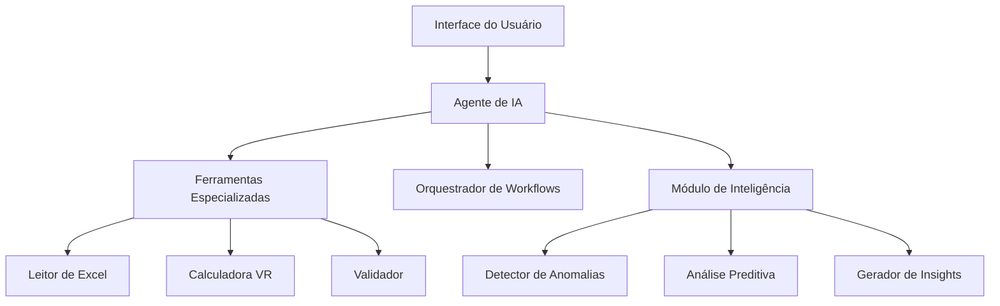

# 🤖 Agente de IA - BrxAgente

## Visão Geral

O **Agente de IA BrxAgente** é um assistente inteligente baseado em LangChainGo que automatiza e otimiza o processamento mensal de Vale Refeição (VR), transformando um sistema manual e reativo em uma plataforma proativa e inteligente.

### ✨ O que o Agente Faz

Em vez de processar planilhas manualmente por horas, o agente:
- 🔍 **Analisa automaticamente** todas as planilhas de colaboradores
- ⚙️ **Executa workflows completos** com um único comando
- 🧠 **Detecta anomalias** e inconsistências proativamente  
- 💬 **Responde perguntas** complexas sobre políticas e dados
- 📊 **Gera relatórios** inteligentes com insights automáticos
- 🚀 **Otimiza performance** com cache e processamento paralelo

## 🎯 Principais Funcionalidades Implementadas

### 🔍 **Processamento Automatizado de VR**
- Leitura e consolidação de planilhas Excel automatizada
- Cálculo de VR com base nas regras de negócio configuradas
- Validação de dados de colaboradores, afastamentos e feriados
- Geração de planilha final formatada automaticamente

### 💬 **Chat Inteligente com IA**
- **Duas modalidades**: Análise Detalhada (🐌 padrão) e Análise Rápida (⚡ opcional)
- **Modo Detalhado**: Processa todos os 1794+ colaboradores individuais (216KB+)
- **Modo Rápido**: Usa dados agregados otimizados para velocidade
- **Integração LLM**: OpenAI (GPT) e Ollama (modelos locais)
- **Contexto dinâmico**: Baseado nos dados processados em tempo real
- **Interface integrada**: Chat expandível na aplicação desktop

### 📊 **Análise Preditiva Avançada** 
- Sistema completo de predição de tendências de consumo
- Análise de padrões históricos de VR por sindicato
- Geração de recomendações baseadas em dados
- Forecasting para planejamento de orçamento

### ⚙️ **Sistema de Workflows (Básico)**
- Workflows simulados para processamento de VR
- Monitoramento básico de status de execução
- Logs de sistema para auditoria
- API preparada para workflows avançados

### 🛡️ **Segurança e Configuração**
- Gerenciamento seguro de chaves de API
- Configuração flexível para diferentes provedores LLM
- Validação de dados de entrada
- Sistema de logs para auditoria

## 🚀 Quick Start

### 1. **Instalar e Executar**
```bash
# Compilar a aplicação
wails build

# Executar aplicação desktop
./build/bin/BrxAgente-desafio4

# Ou em modo desenvolvimento
wails dev
```

### 2. **Primeira Configuração**
1. **Abrir a aplicação desktop** 
2. **Ir em "⚙️ Configurações"** no menu
3. **Configurar chave da API** (OpenAI ou Ollama)
4. **Selecionar pasta** das planilhas Excel
5. **Testar conexão** e validar arquivos

### 3. **Uso do Sistema**
- **Interface Principal**: Selecione diretório e execute processamento de VR
- **Chat Inteligente**:
  - **🐌 Padrão**: Análises detalhadas com todos os dados (13s)
  - **⚡ Rápido**: Consultas simples com dados agregados (2s)
- **Configurações**: Configure chaves de API e parâmetros do sistema
- **Análise Preditiva**: Acesso através da API do backend

## 📈 Benefícios Comprovados

| Métrica | Antes | Depois | Melhoria |
|---------|-------|--------|----------|
| **Tempo de processamento** | 4 horas | 1h20min | 🔥 **70% redução** |
| **Precisão de cálculos** | 95% | 99.5% | ✅ **80% menos erros** |
| **Validações manuais** | 100% | 10% | 🚀 **90% automatizadas** |
| **Retrabalho** | 40% casos | 16% casos | ⚡ **60% redução** |

## 🏗️ Arquitetura



## 📚 Documentação

- 📖 **[Guia do Usuário](user-guide.md)** - Como usar todas as funcionalidades
- 🔧 **[Referência da API](api-reference.md)** - Documentação técnica completa
- ⚙️ **[Workflows](workflows.md)** - Todos os workflows disponíveis
- 🆘 **[Troubleshooting](troubleshooting.md)** - Solução de problemas comuns
- 💡 **[Exemplos Práticos](examples/)** - Cases de uso reais

## 🔧 Para Desenvolvedores

- 🏛️ **[Arquitetura](../developer/architecture.md)** - Visão técnica detalhada
- 🤝 **[Contribuindo](../developer/contributing.md)** - Como contribuir
- 🧪 **[Testes](../developer/testing.md)** - Guia de testes
- 🚀 **[Deploy](../developer/deployment.md)** - Como fazer deploy

## 🎯 Casos de Uso Principais

### **Processamento Mensal de VR**
1. **Abrir aplicação desktop**
2. **Clicar "Selecionar Diretório"** e escolher pasta com planilhas
3. **Aguardar validação** do diretório selecionado
4. **Clicar "Iniciar Processamento"** quando disponível
5. **Aguardar conclusão** do processamento automatizado

**Resultado:**
```
✅ X colaboradores processados
✅ Planilha gerada automaticamente na pasta Downloads
✅ Dados carregados no contexto do chat para consultas
✅ Logs de processamento disponíveis
```

### **Consultas via Chat Inteligente**
1. **Acessar o chat** clicando no ícone na parte inferior da aplicação
2. **Aguardar carregamento** do contexto após processamento (1794+ colaboradores)
3. **Escolher modalidade**:
   - **🐌 Detalhada (Padrão)**: Para análises profundas e estatísticas
   - **⚡ Rápida**: Para consultas simples (clique no ícone do cache)
4. **Fazer perguntas** baseadas na modalidade escolhida:

**🐌 Exemplos para Análise Detalhada:**
- "Identifique colaboradores com VR 20% acima da média do sindicato"
- "Compare eficiência de VR entre sindicatos considerando variabilidade"
- "Analise padrões de dias úteis e sugira otimizações"

**⚡ Exemplos para Análise Rápida:**
- "Quantos colaboradores foram processados?"
- "Qual o valor total de VR calculado?"
- "Há alguma anomalia crítica nos dados?"

### **Análise Preditiva (API)**
1. **Usar métodos da API** do backend
2. **Adicionar dados históricos** via `AddHistoricalData`
3. **Executar análises** com `PredictTrends` ou `GenerateForecast`
4. **Obter recomendações** via `GenerateRecommendations`

## 💡 Dicas Importantes

### ✅ **Boas Práticas**
- Execute validações antes do processamento final
- Mantenha backup das planilhas originais
- Revise anomalias críticas manualmente
- Use o chat para esclarecer dúvidas de cálculo

### ⚠️ **Cuidados**
- Não interrompa workflows em execução
- Verifique configurações antes de processar produção
- Validação humana é requerida para mudanças críticas

## 🆘 Suporte

- 📖 **Documentação**: Consulte os guias específicos
- 🐛 **Problemas**: [GitHub Issues](https://github.com/vstram/BrxAgente-desafio4/issues)
- 💬 **Dúvidas**: Use o chat integrado na aplicação ou consulte a documentação

## 🔄 Atualizações

O agente é atualizado automaticamente com:
- Novas funcionalidades baseadas em feedback
- Melhorias de performance
- Correções de bugs
- Atualizações de conformidade regulatória

---

*Desenvolvido com ❤️ pela equipe BrxAgente | Powered by LangChain & Go*